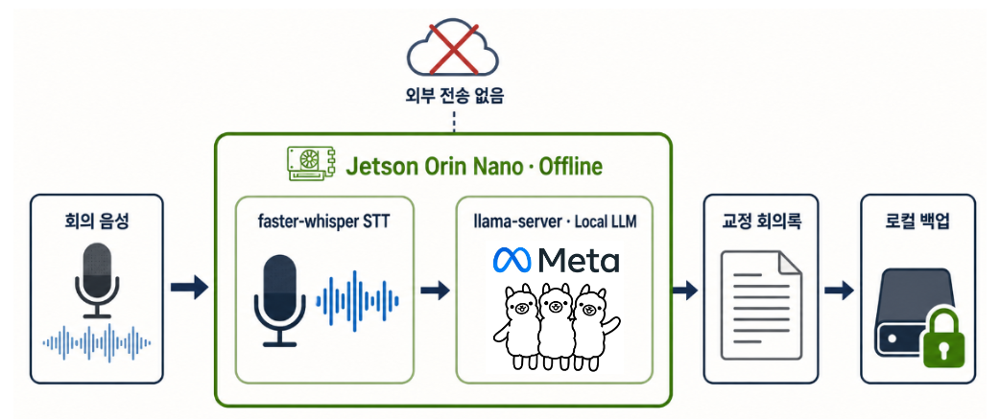

<div align="center">

# Secure Edge Meeting Transcription

### 외부 전송 없이, Jetson 한 대에서 완성하는 한국어 회의록

기업 보안 환경을 위한 온디바이스 한국어 회의 자동 전사·교정 PoC

<br />

[📚 기술 블로그에서 구현 과정 보기](https://velog.io/@juwqq1234/Edge-AI-Jetson-Orin-Nano%EC%97%90%EC%84%9C-%ED%95%9C%EA%B5%AD%EC%96%B4-%ED%9A%8C%EC%9D%98-%EC%9E%90%EB%8F%99-%EC%A0%84%EC%82%AC-%EC%8B%9C%EC%8A%A4%ED%85%9C-%EA%B5%AC%ED%98%84%ED%95%98%EA%B8%B0)

</div>

---

## 📖 프로젝트 소개

**Secure Edge Meeting Transcription**은 회의 음성을 외부 클라우드로 전송할 수 없는 기업 환경을 가정하여, Jetson Orin Nano 내부에서 한국어 음성 전사부터 회의록 교정과 백업까지 수행하는 PoC 프로젝트입니다.

- `faster-whisper`가 회의 음성을 한국어 텍스트로 변환합니다.
- `llama-server`로 실행한 로컬 LLM이 STT 오인식과 문장을 교정합니다.
- 교정 회의록과 한 줄 요약, 처리 성능을 Jetson 내부 저장장치에 백업합니다.
- STT와 LLM을 장비 내부에서 실행해 음성 원본과 회의 내용을 외부로 전송하지 않습니다.

작은 STT 모델로 빠르게 초안을 만든 뒤 로컬 LLM이 문맥을 이용해 전문용어, 숫자와 문장을 교정하는 구조로 정확도와 처리 속도의 균형을 검증했습니다.

---

## 🛠 기술 스택

| 분류 | 기술 |
|---|---|
| **Edge Device** | [](https://www.nvidia.com/ko-kr/autonomous-machines/embedded-systems/jetson-orin/nano-super-developer-kit/) |
| **OS & Language** | [](https://ubuntu.com/) [](https://www.python.org/) |
| **Speech To Text** | [](https://github.com/SYSTRAN/faster-whisper) [](https://github.com/OpenNMT/CTranslate2) |
| **Local LLM** | [](https://github.com/ggml-org/llama.cpp) [](https://github.com/ggml-org/ggml/blob/master/docs/gguf.md) |
| **Audio** | [](https://www.alsa-project.org/) `16 kHz · Mono WAV` |
| **Storage** |  |
| **Optional TTS** | [](https://github.com/myshell-ai/MeloTTS) |

---

## 📡 시스템 아키텍처

<div align="center">
  
</div>

1. 마이크 입력을 `arecord`가 16 kHz Mono WAV로 녹음합니다.
2. `faster-whisper`가 한국어 STT 초안을 생성합니다.
3. `llama-server`의 로컬 LLM이 오인식과 문장을 교정합니다.
4. 교정 회의록과 한 줄 요약, 처리 시간을 Jetson 내부에 백업합니다.

모든 핵심 처리는 Jetson Orin Nano 내부에서 완료되며 회의 음성과 전사 결과를 외부 클라우드로 전송하지 않습니다.

---

## 🧪 PoC 비교 변수: 로컬 LLM 후보 3종

Jetson Orin Nano의 제한된 메모리에서 STT 모델과 LLM을 함께 실행할 수 있도록 모델 크기와 양자화 방식을 기준으로 세 후보를 선정했습니다.

| 후보 | 모델 | 크기·양자화 | 선정 기준 |
|---|---|---|---|
| **A** | `Bllossom 8B` | 8B · Q4_K_M · 약 4.9 GB | 한국어 특화 모델의 교정 성능 검증 |
| **B** | `Qwen3.5 2B` | 2B · Q5_K_M | 다국어 이해, 지시 이행과 자원 효율의 균형 |
| **C** | `Kanana Nano 2.1B` | 2.1B · Q5_K_M | 국내 서비스 지향 경량 모델의 속도와 메모리 효율 검증 |

세 후보는 동일한 268자 한국어 회의 대본으로 각각 3회씩 측정했습니다.

### 평가 지표

```text
전사 정확도(%) = 기준 대본과 일치하는 글자 수 / 268 × 100

RTF = STT 시작부터 LLM 교정 완료까지 걸린 시간 / 입력 음성 길이
```

- `RTF < 1.0`이면 발화 시간보다 빠르게 처리가 완료되었다는 뜻입니다.
- 정확도뿐 아니라 숫자, 날짜, 장비명과 같은 핵심 정보의 보존 여부도 함께 확인했습니다.

---

## 📊 실험 결과

### 한국어 전사 정확도

| 후보 | 1차 | 2차 | 3차 | 평균 |
|---|---:|---:|---:|---:|
| A · Bllossom 8B | 78.73% | 77.99% | 82.19% | 79.64% |
| **B · Qwen3.5 2B** | **88.43%** | **90.67%** | **91.79%** | **90.30%** |
| C · Kanana Nano 2.1B | 89.55% | 88.44% | 87.43% | 88.47% |

### 실시간성(RTF)

| 후보 | 1차 | 2차 | 3차 | 평균 |
|---|---:|---:|---:|---:|
| A · Bllossom 8B | 0.51 | 0.54 | 0.52 | 0.52 |
| **B · Qwen3.5 2B** | 0.33 | 0.35 | **0.26** | **0.31** |
| C · Kanana Nano 2.1B | 0.32 | **0.31** | 0.33 | 0.32 |

### 최종 선정

`Qwen3.5 2B Q5_K_M`은 평균 정확도 **90.30%**, 평균 RTF **0.31**로 정확도와 실시간성이 가장 균형 잡힌 결과를 기록해 최종 LLM으로 선정했습니다.

- Bllossom 8B는 가장 큰 모델이지만 메모리 부담이 컸고 정확도와 RTF 모두 가장 낮았습니다.
- Kanana Nano 2.1B는 빠른 교정 속도를 보였지만 올바른 문장을 불필요하게 변경하는 사례가 관찰되었습니다.
- Qwen3.5 2B는 제한된 자원 안에서 정확도 손실을 억제하면서 빠르게 처리했습니다.

> 측정 결과는 해당 Jetson 환경, 모델 파일, 양자화 방식, 발화 속도와 주변 소음에 따라 달라질 수 있습니다.

---

## 🚀 개선 결과

### Whisper `tiny` → `small`

전문용어와 숫자의 정확도를 개선하기 위해 STT 모델을 `tiny`에서 `small`로 변경했습니다.

| STT 모델 | 전사 정확도 | RTF | 해석 |
|---|---:|---:|---|
| `tiny` | 후보별 평균 기준 최대 90.30% | 최대 0.31 수준 | 실시간 처리에 유리 |
| `small` | **98.9%** | **1.0098** | 정확도는 향상되지만 처리 시간이 증가 |

정확도와 실시간성 사이의 트레이드오프를 확인했으며, 실제 환경에서는 회의 성격과 요구 응답 시간에 따라 STT 모델을 선택할 수 있습니다.

### 추가 개선 사항

- D2 라인, 수율, 식각, 과식각, 웨이퍼, CMP, 파티클과 로트 등 반도체 전문용어 컨텍스트 제공
- 핵심 보고 내용, 문제 원인, 조치 사항과 결정 사항의 한 줄 요약 생성
- `~/meet/bak_YYYYMMDD_HHMMSS.txt` 형식으로 결과 자동 백업
- STT, LLM 교정, 요약과 선택적 TTS 구간의 처리 시간 분리 측정

---

## ▶️ 실행 방법

### 1. Python 환경 구성

```bash
python3 -m venv .venv
source .venv/bin/activate
python -m pip install --upgrade pip
python -m pip install faster-whisper
sudo apt install -y alsa-utils
```

### 2. 로컬 LLM 서버 실행

```bash
./llama-server \
  -m /path/to/model.gguf \
  --host 127.0.0.1 \
  --port 8080 \
  -c 4096
```

### 3. 회의 전사 실행

```bash
source .venv/bin/activate
python voice_transcription.py
```

Whisper 모델을 직접 선택하려면 `ASR_MODEL`을 지정합니다.

```bash
ASR_MODEL=tiny python voice_transcription.py
ASR_MODEL=small python voice_transcription.py
```

---

## 🔐 보안 원칙

- 마이크 원본과 회의록을 외부 API 또는 클라우드 저장소로 전송하지 않습니다.
- `llama-server`는 기본적으로 루프백 주소 `127.0.0.1`에만 바인딩합니다.
- 결과는 Jetson 내부의 접근 통제된 경로에 저장합니다.
- 실제 기업 적용 시 디스크 암호화, 사용자 권한 분리, 보존 기간과 로그 마스킹 정책을 추가해야 합니다.

